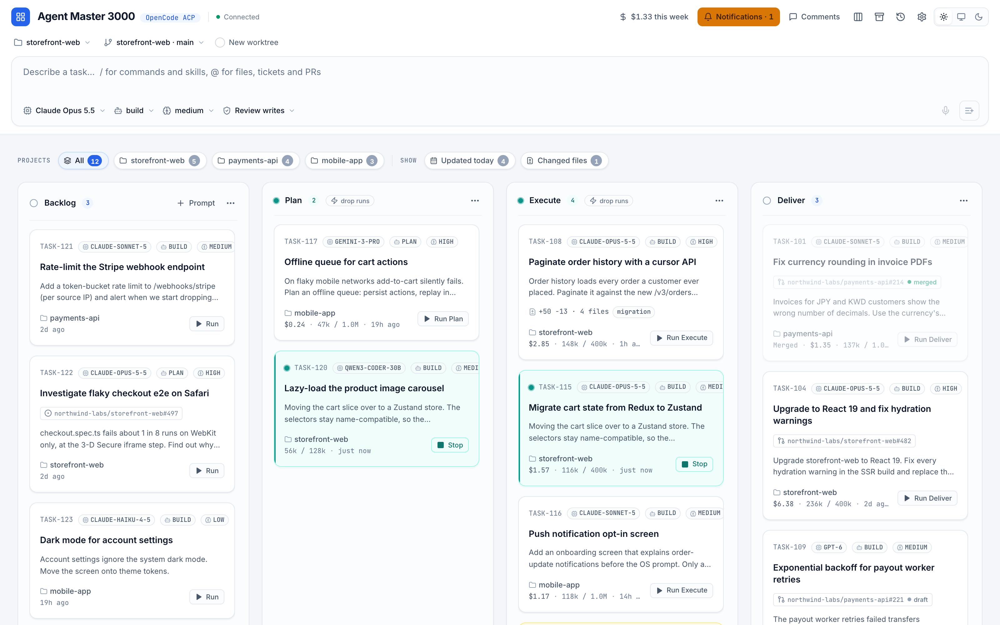
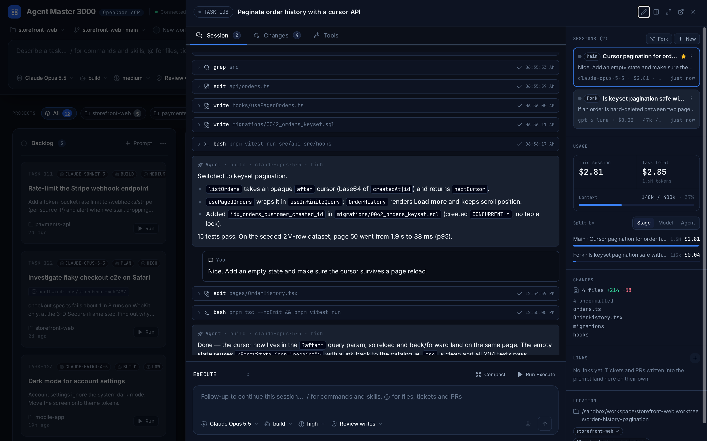
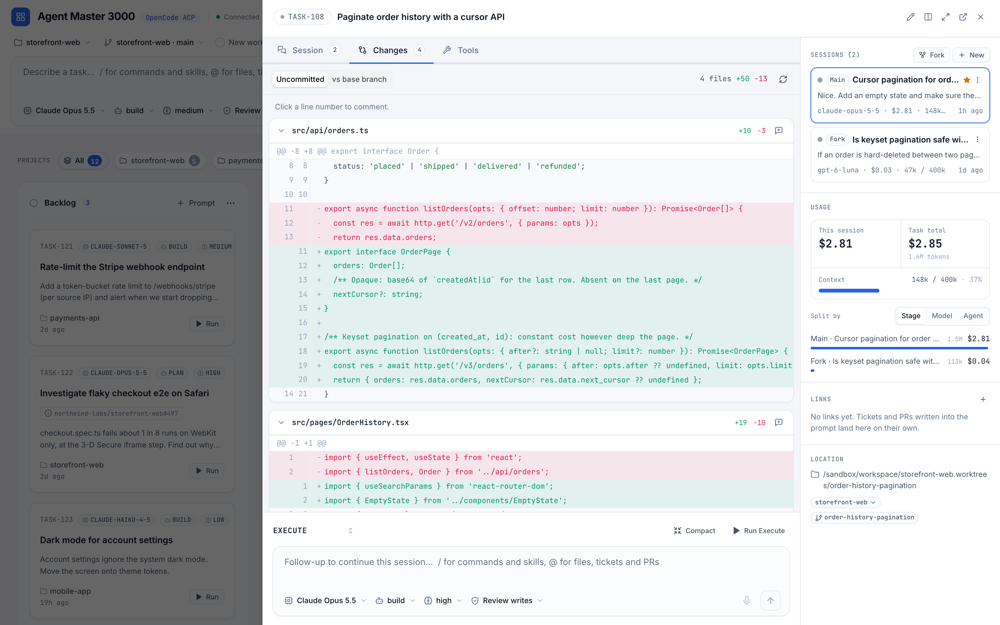
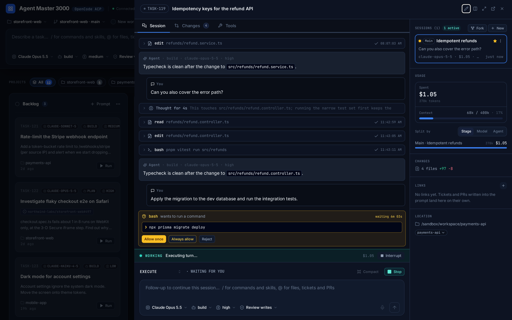
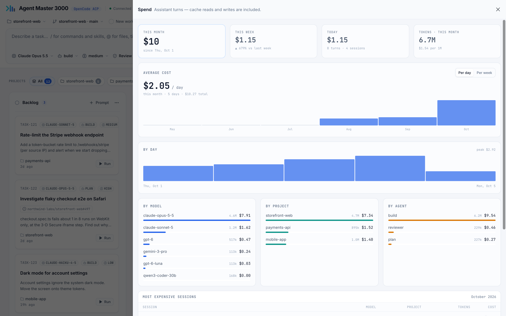

# Agent Master 3000

 A better UI for working with AI agents and keeping track of all of your [OpenCode](https://opencode.ai) sessions. Kanban board inspired way
 that allows you a better overview of your work with AI agents.

All your projects in place. Instead of long lists of sessions spread across many projects where it is hard to keep track of status of your work, you can have it presented in a single view, so that making progress is much easier.




## Requirements

- **Node.js 22.13 or newer.** The board reads OpenCode's SQLite database with
  `node:sqlite`, which needs 22.13 (or 23.4+).
- **OpenCode** on your `PATH`, signed in to at least one provider. Tested with
  OpenCode 1.14.51 to 1.18.32 (the sandbox e2e below pins the newest).
- Optional: `gh` (GitHub mentions and PR status), `acli` (Jira mentions and
  ticket status), `uv` or `whisper-server` (voice dictation), `ffmpeg`
  (videos on prompts).

## Install

Download a release tarball from
[GitHub Releases](https://github.com/dino-keskic/agent-master-3000/releases) and install
it globally:

```bash
npm install -g https://github.com/dino-keskic/agent-master-3000/releases/download/v2.0.0/agent-master-3000-2.0.0.tgz
```

Every release also carries a `SHA256SUMS.txt`. To check a downloaded tarball:
`sha256sum -c SHA256SUMS.txt`.

Then start it:

```bash
agent-master-3000                          # http://127.0.0.1:3737
agent-master-3000 --port 4000 --data-dir ~/boards/work
agent-master-3000 --help
```

The installed board keeps its state in `~/.local/share/agent-master-3000` (or
`$XDG_DATA_HOME/agent-master-3000`; `%LOCALAPPDATA%\agent-master-3000` on Windows). Nothing is
published to the npm registry.

### Where things are

The first time it opens, the board shows where it keeps its data and where it
found OpenCode: the program, its config folder, its sessions database and its
model list. Anything in an unusual place can be pointed at there, or later from
**Settings** (the gear in the header). Settings can also add extra environment
for OpenCode, such as `XDG_DATA_HOME` when its sign-ins live elsewhere.

Choosing a different data folder takes effect on the next start. If that folder
has no board yet, the board asks whether to copy this one over; the copy happens
at startup and leaves the old folder as it was.

These choices are saved in a setup file: `~/.config/agent-master-3000/config.json`
(`$XDG_CONFIG_HOME/agent-master-3000`; `%APPDATA%\agent-master-3000` on Windows; `./data/config.json`
from a checkout). Another one can be given with `--config`. An environment
variable always wins over the setup file, and a location set by one is shown
locked. To see what the board resolved without starting it:

```bash
agent-master-3000 --paths
```

### OpenCode config

The board reads OpenCode's config the way OpenCode merges it, later layers
winning, and **Settings** lists every layer with the files it found:

1. the global folder, `~/.config/opencode` (`$XDG_CONFIG_HOME/opencode`) —
   always loaded, whatever else is set;
2. `OPENCODE_CONFIG`, one extra file;
3. each project's `opencode.json(c)` and `.opencode/`, from the task's folder up
   to its git root;
4. `OPENCODE_CONFIG_DIR`, an optional extra folder loaded on top of the global
   one, not instead of it;
5. the board's own tool rules from **Settings → Tools**.

Models are read in every board project, so a provider set up in one project's
`opencode.json` is offered too, marked *(only in that project)*. OpenCode reads
its config once when it starts; when a config file or agent changes, the board
restarts the agent the next time nothing is running, and shows a notice with a
**Restart now** button while a task is busy.

### From a checkout

```bash
npm ci
npm run build
npm start                          # the same app as above, on 3737
```

## What it does

- **Tasks on a board.** Columns hold tasks; a column can carry a prompt that
  runs when a card enters it, and can start a fresh session or compact the old
  one on the way in. Tasks can be archived, filtered by project, and opened two
  at a time side by side (`?task=A,B`).
- **Live agent sessions.** Each task runs one or more OpenCode sessions over
  ACP. The transcript, tool calls and subagents stream in over a websocket.
  Model, agent and thinking level are picked per session. Follow-up prompts can
  be queued and cancelled before they are sent.
- **Permissions and questions.** The permission mode is `review-writes` by
  default, or `auto` / `manual`, per board or per task. Approvals and the
  agent's questions show up on the card and in the drawer.
- **Spend.** Cost per session, per task and per board, estimated from
  OpenCode's model catalog.
- **Import.** Sessions started in the OpenCode CLI can be pulled onto the
  board, with their history and subagents.
- **Code.** A per-task git worktree, a diff viewer, changed-file counts on the
  card, and "open in editor" (VS Code, Cursor, Windsurf, Zed, WebStorm).
- **Mentions and links.** `@`-mention project files, GitHub PRs and issues
  (via `gh`) and Jira tickets (via `acli`, with `JIRA_SITE` set). Links on a
  card show whether the PR is merged or the ticket is done.
- **Board MCP server.** Every session gets a small MCP server so the agent can
  read review comments, manage its task's links and move its session.
- **Slash commands and skills** from the project's `.opencode/` / `.claude/`
  and your OpenCode config dir, plus the board's own `/compact`.
- **Attachments, dictation, notifications.** Images on prompts, and videos,
  sampled at 2 fps by ffmpeg into one captioned contact sheet; local voice
  dictation (Parakeet via `uv` on Apple Silicon, or `whisper-server`); browser
  notifications when a task you are not looking at needs you or finishes.

## Screenshots

The data below is invented: a seeded demo board from the Docker sandbox
(`npm run sandbox:demo`), with its costs worked out by the board from generated
OpenCode sessions.

**A task's session.** It shows the transcript and tool calls, forks, and the
session's cost and context.



**Changes.** It shows the uncommitted diff of the task's worktree, and you can
comment on any line.



**Permissions.** An agent waiting on a command shows up on the card and in the
drawer.



**Spend.** The report breaks spending down by day, model, project and agent.



## Configuration

Everything is optional. Command-line flags win over the environment, and the
environment wins over the [setup file](#where-things-are).

| Variable | Default | What it does |
| --- | --- | --- |
| `PORT` | `3737` installed, `3001` in dev | Port the server listens on (`--port`) |
| `HOST` | `127.0.0.1` | Bind address (`--host`). Read [Security](#security) before changing it |
| `AGENT_MASTER_DATA_DIR` | see [Install](#install); `./data` in dev | Where state and attachments go (`--data-dir`) |
| `BOARD_STATE_FILE` | `<data dir>/board_state.json` | The board document; transcripts go in `<file>.logs/` beside it |
| `BOARD_ATTACHMENTS_DIR` | `<data dir>/attachments` | Uploaded images and video contact sheets |
| `FFMPEG_PATH`, `FFPROBE_PATH` | searched | ffmpeg and ffprobe, when not on `PATH` or in Homebrew |
| `BOARD_ALLOWED_HOSTS` | unset | Extra hostnames the server answers to, comma separated |
| `BOARD_TOKEN` | unset | Require this token from every client; see [Security](#security) |
| `AGENT_MASTER_CONFIG` | see [Where things are](#where-things-are) | The setup file (`--config`) |
| `OPENCODE_BIN` | found on `PATH` or in the usual install folders | OpenCode executable |
| `ACP_COMMAND` | `opencode acp` | Command spawned for an ACP session |
| `OPENCODE_DB` | OpenCode's default | The `opencode.db` sessions are read from (read-only) |
| `OPENCODE_CONFIG_DIR` | unset | An extra config folder loaded on top of the global one; see [OpenCode config](#opencode-config) |
| `OPENCODE_CONFIG` | unset | An extra config file, merged after the global one |
| `OPENCODE_MODELS_PATH` | OpenCode's cache | Model and pricing catalog used for spend (`OPENCODE_MODELS` also works) |
| `JIRA_SITE` | unset | e.g. `acme.atlassian.net`. Turns on Jira mentions via `acli` |
| `ACP_DEBUG` | off | `1` logs the raw ACP traffic, including transcript excerpts |
| `SPEECH_ENGINE` | auto | `parakeet` or `whisper` |
| `SPEECH_IDLE_MINUTES` | `20` | Stop the dictation model after this long unused |
| `PARAKEET_MODEL`, `UV_BIN` | | Parakeet model id and `uv` path |
| `WHISPER_MODEL`, `WHISPER_MODELS_DIR`, `WHISPER_LANGUAGE`, `WHISPER_SERVER_BIN` | | whisper.cpp settings (`WHISPER_LANGUAGE` defaults to `auto`) |
| `VITE_DEV_PORT`, `VITE_DEV_HOST`, `API_PORT` | `3999`, `127.0.0.1`, `3001` | Dev server only |

## Security

The board starts coding agents that run shell commands as you, so its API is as
powerful as your shell. It is built to be reached from this machine only.

- **It binds loopback.** Setting `HOST=0.0.0.0` (or any non-loopback address)
  puts that power on the network, and the server warns loudly at start-up. If
  you do it, set `BOARD_TOKEN` to a long random value and only on a network you
  trust: the token travels in plain text over HTTP. An SSH tunnel
  (`ssh -L 3737:127.0.0.1:3737 host`) is the safer way to reach a remote board.
- **Web pages cannot drive it.** Every request is checked before any route runs.
  The `Host` header must be `localhost`, `127.0.0.1`, `[::1]`, a `*.localhost`
  name, the bind address, or a name in `BOARD_ALLOWED_HOSTS`, which stops DNS
  rebinding. A browser `Origin` must be one of those too, and requests the
  browser marks cross-site are refused. The websocket gets the same check, and
  CORS allows only those origins.
- **The token.** With `BOARD_TOKEN` set, open the UI once as
  `http://<host>:<port>/?token=<value>`. The page moves it into a
  `SameSite=Strict` cookie and removes it from the address bar. The board's MCP
  server gets the token; the agent's own shell environment does not.
- **Local processes are trusted.** Anything running as you can call the API,
  including the agents the board starts. The MCP tools only touch the current
  task, but an agent with a shell can `curl` the whole API.
- **Logs and state are private.** `ACP_DEBUG=1` output and the state file hold
  prompts, task titles and links in plain text.

## Development

```bash
npm install
npm run dev          # UI http://127.0.0.1:3999, API http://127.0.0.1:3001, state in ./data
npm run dev:scratch  # a second instance: UI 3998, API 3002, its own state file
```

Before committing:

```bash
npx tsc --noEmit && npx eslint . && npm test && npm run build
```

`npm test` is the unit suite (`node:test` via `tsx`). It needs neither Docker
nor OpenCode.

`AGENTS.md` is the contributor guide: how the code is split between `shared/`
(pure logic, always tested), `server/` (I/O) and `src/` (React), and the rules
for coding agents working on this repo.

| Part | What it is |
| --- | --- |
| `src/` | React 18 + TypeScript + Vite, Mantine + Tailwind |
| `server/` | Express + `ws`; speaks ACP to an OpenCode child process |
| `shared/` | Types and pure logic used by both sides and by the tests |
| `tests/` | `node:test` suites over `shared/` and `server/` |
| `sandbox/` | Docker image with its own OpenCode, for tests that need one |

### Testing against a real OpenCode, in Docker

```bash
npm run sandbox:test                            # the unit suite in a container with no network
npm run sandbox:e2e                             # the board against a real `opencode acp` and a stub model
OPENCODE_VERSION=1.16.2 npm run sandbox:e2e     # the same, against another OpenCode release
npm run sandbox:board                           # the board at http://127.0.0.1:4999, fake agent
```

The e2e runs in a container with no network at all, no published ports, no
mounts and no host environment. Its OpenCode, config, database and model (a
scripted OpenAI-compatible stub) all live inside the container, so it cannot
reach your own OpenCode install or any provider. See
[sandbox/README.md](sandbox/README.md).

### Releasing

```bash
npm version X.Y.Z
git push --follow-tags
```

The Release workflow checks that the tag matches `package.json`, runs the full
CI, builds and smoke-tests the installed tarball, and publishes a GitHub Release
with the tarball, `SHA256SUMS.txt` and generated notes. Tags like `1.2.0-rc1`
become prereleases.

## License

[MIT](LICENSE)
